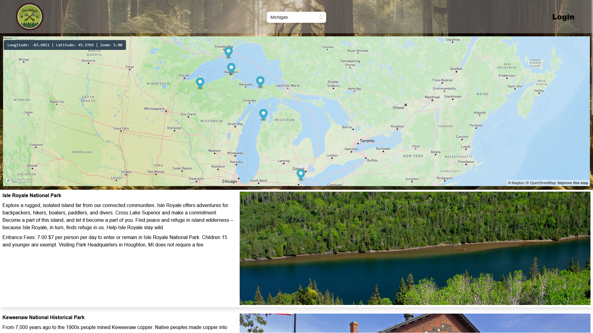

# Trail Blazer

## Description

Are you an avid traveler or simply love the idea of exploring nature but can't decide where to head next? Look no further - TrailBlazer is here to solve your predicament!

TrailBlazer is a comprehensive application that offers a detailed database of US National Parks, right at your fingertips. 

In the age of digital revolution, we noticed a glaring void - there wasn't a comprehensive, user-friendly platform that catered to enthusiastic travelers looking for detailed information on our nation's National Parks. That's when the idea of TrailBlazer was conceived.

Our dedicated team embarked on an extensive brainstorming journey, realizing the immense potential such a platform could hold. We envisioned a tool that would not only present data on our nation's beautiful National Parks but would also aid in planning and enhancing future trips for travelers of all types.
Understanding the need for this information hub, we decided to take matters into our own hands. Our aim was to create a single, easy-to-use platform that would serve as a one-stop-shop for all National Park enthusiasts.

As we embarked on our journey to create TrailBlazer, our motivation stemmed from two profound sources - our unwavering pursuit of excellence and our deep-rooted love for national parks. There's an undeniable allure to the unspoiled wilderness, the majestic landscapes, and the serenity that our national parks offer. Could there be a better muse than Mother Nature herself? We think not!
The goal was clear: to create a sophisticated and user-friendly React application that perfectly encapsulates the needs and desires of true national park enthusiasts. We wanted to provide an interface that is as beautiful, intuitive, and awe-inspiring as the parks it represents.

## Installation

This is a web app deployed on Heroku and does not require any installation

## Usage

https://nps-trailblazer.herokuapp.com/

To use our application, navigate the to home page linked above and select the state you are interested in seeing National Parks. If you would like to leave reviews, add a park to you visited list (fire emblem), or add a park to your wishlist (green emblem) - sign up. You can then view your user profile page with all you content. 

## Credits

* John Scicluna
* Jacob Jeffries
* Damian Galus
* Ryan Mennemeier

We utilized:
* JS, HTML, CSS
* Tailwind for styling
* Mapbox
* OpenWeather
* Apollo server & GraphQL
* MongoDB 
* JWT for authentication

## License

MIT License

Copyright (c) [2023] [Scicluna, Jeffries, Galus, Mennemeier]

Permission is hereby granted, free of charge, to any person obtaining a copy
of this software and associated documentation files (the "Software"), to deal
in the Software without restriction, including without limitation the rights
to use, copy, modify, merge, publish, distribute, sublicense, and/or sell
copies of the Software, and to permit persons to whom the Software is
furnished to do so, subject to the following conditions:

The above copyright notice and this permission notice shall be included in all
copies or substantial portions of the Software.

THE SOFTWARE IS PROVIDED "AS IS", WITHOUT WARRANTY OF ANY KIND, EXPRESS OR
IMPLIED, INCLUDING BUT NOT LIMITED TO THE WARRANTIES OF MERCHANTABILITY,
FITNESS FOR A PARTICULAR PURPOSE AND NONINFRINGEMENT. IN NO EVENT SHALL THE
AUTHORS OR COPYRIGHT HOLDERS BE LIABLE FOR ANY CLAIM, DAMAGES OR OTHER
LIABILITY, WHETHER IN AN ACTION OF CONTRACT, TORT OR OTHERWISE, ARISING FROM,
OUT OF OR IN CONNECTION WITH THE SOFTWARE OR THE USE OR OTHER DEALINGS IN THE
SOFTWARE.

## Features

* Mapbox component showing the locations of each National Park within the chosen state
* Specific pages for each park showing alerts, local weather forecasts, campground information, and events
